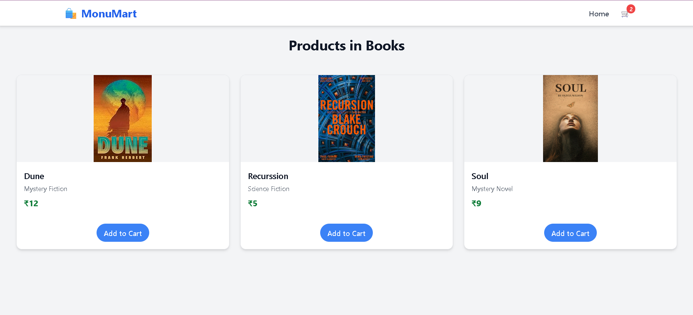
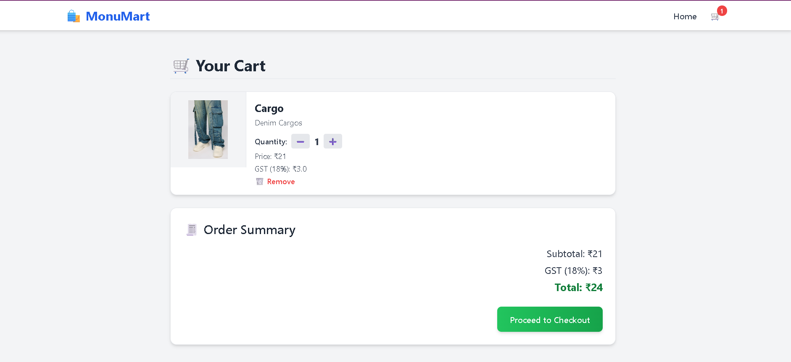

# 🛒 MonuMart - Flask Shopping Cart App

A fully functional e-commerce shopping cart app built with **Flask**, **Tailwind CSS**, and **SQLite**. Includes category filtering, cart management and GST/tax calculations.

## 🚀 Features

- 🧠 Category-wise product listing
- 📦 Add/Remove from Cart
- 💰 GST & Total Calculations
- 🎨 Tailwind-powered responsive UI

## 🛠️ Built With

- Python (Flask)
- Tailwind CSS
- SQLite (via SQLAlchemy)
- Jinja Templates

## 📸 Screenshots

### 🏠 Homepage


### 🛒 Products Page


### 💳 Cart Page


## 🔗 Demo

Live Demo: *Coming Soon*

## 📁 Installation

```bash
git clone https://github.com/StacktiSingh/MonuMart.git 
cd MonuMart
pip install -r requirements.txt
python main.py
